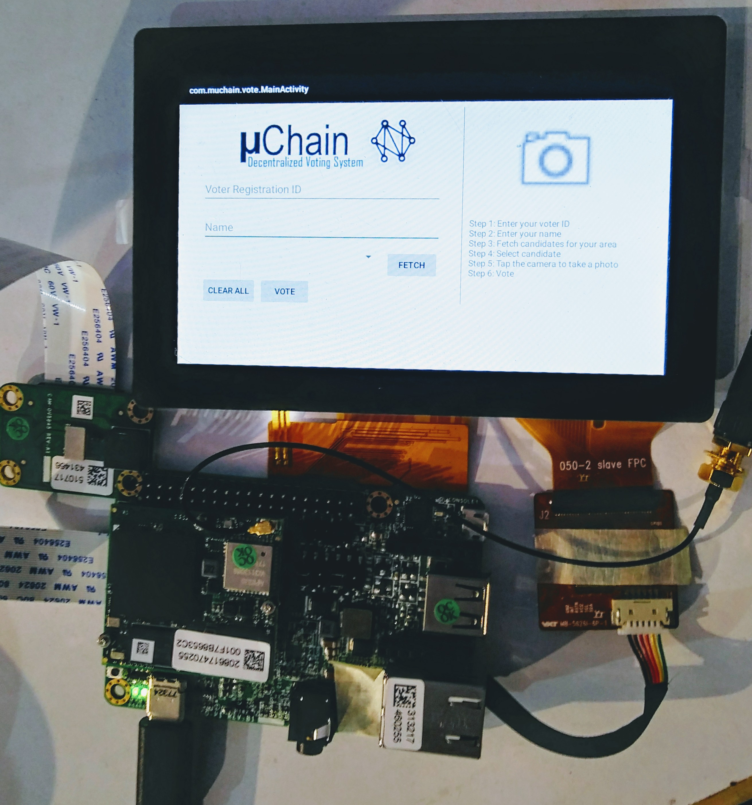
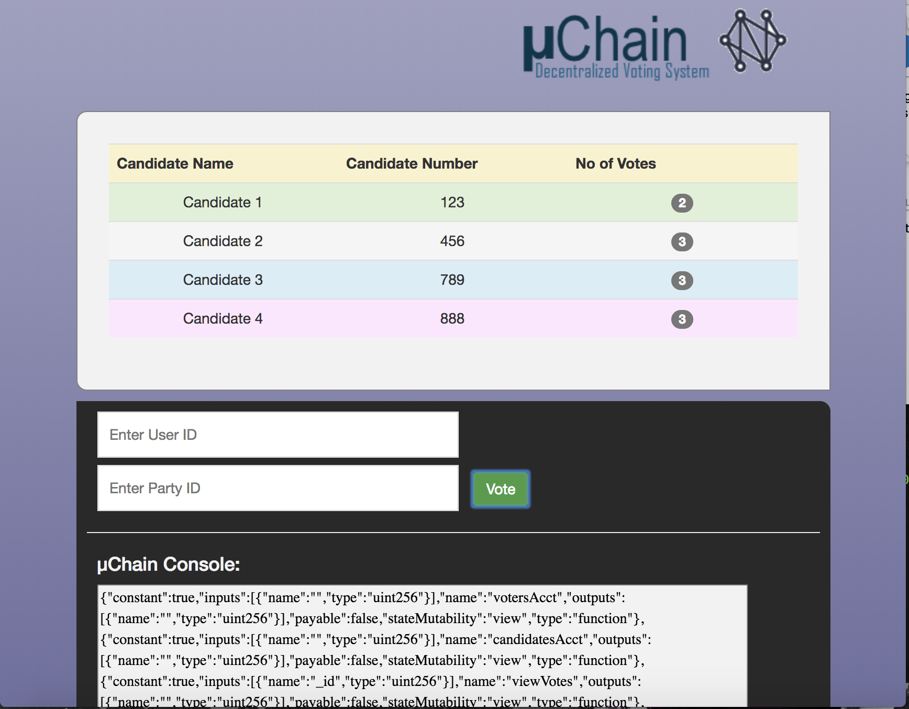

# MuChain

MuChain is a hyper scalable platform for voting or ballot polling. We have designed a new eVoting Machine based on Blockchain technology where each node contains a distributed ledger of votes. It becomes impossible to change, falsify or tamper with the recorded votes. 

The machine comprises of a camera and a fingerprint scanner, allowing us to verify the voter’s identity over Aadhar as well as store a fingerprint of the voter’s face for accountability. 

This information is hashed and encoded into the ledger along with the vote itself and is stored in the BlockChain which is concurrently available on all the eVoting Nodes. 

MuChain is structured such that information is in sub-blockchains which are then encoded into master blockchain network. Each sub unit corresponds to its geographically neighbouring nodes, effectively creating a variant of a Gossip-to-Gossip protocol.

A single voter cannot vote at two different places as the system first verifies the Voter’s ID by Aadhaar Number, Voter’s ID, fingerprint and face recognition and after the vote is casted the voter cannot cast vote gain or travel to another place to vote as the whole system is synchronised. 

The current system of voting in India is:-
1. Centralized: The current system is governed by the Electoral Commission of India, that is an autonomous centralised body that is responsible for conducting the voting. The voting machines are needed to be transported to counting centres for the votes to be counted.
2. Non-Transparent: The votes casted have no way to be verified.
3. Subjected to Human Error: The votes are manually counted from different machines and may be subjected to human math error.
Our current solution solves the above problems and gives us a decentralised, transparent and secure way of Voting.

